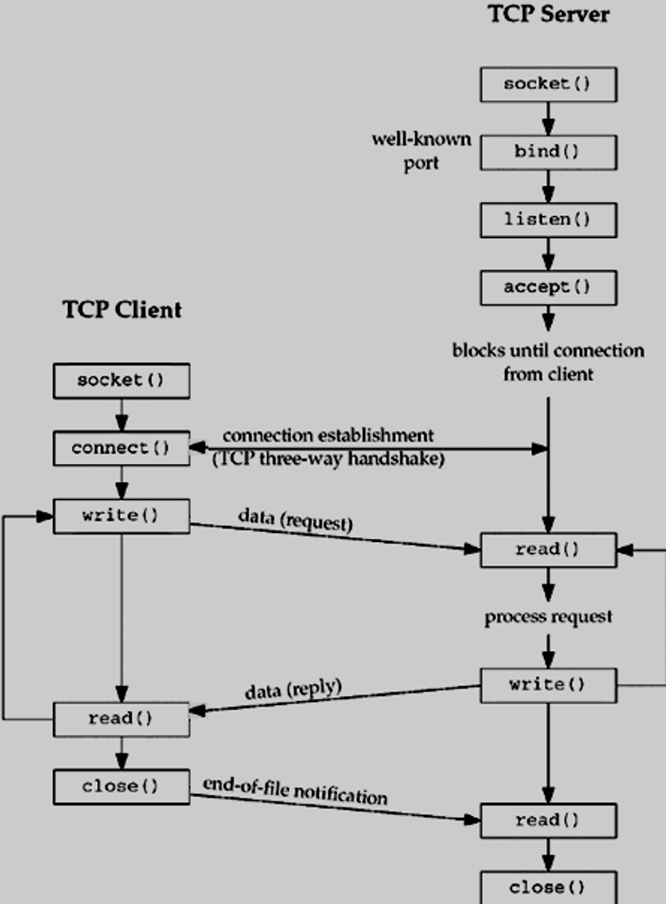

<a name="readme-top"></a>


<!-- PROJECT LOGO -->
<br />
<div align="center">
  <a href="https://github.com/bfjberger/irc_42">
    
  </a>

<h3 align="center">ft_irc</h3>

  <p align="center">
    Summary:
This project is about creating your own IRC server.
You will use an actual IRC client to connect to your server and test it.
Internet is ruled by solid standards protocols that allow connected computers to interact
with each other.
It’s always a good thing to know.
    <br />
    <a href="https://github.com/bfjberger/irc_42"><strong>Explore the docs »</strong></a>
    <br />
  </p>
</div>


<!-- TABLE OF CONTENTS -->

- [About The Project](#about-the-project)
    - [Which client was used ?](#which-client-was-used-)
    - [How to instal IRSSI ?](#how-to-instal-irssi-)
    - [Our implemented commands](#our-implemented-commands)
- [Getting Started](#getting-started)
    - [Prerequisites](#prerequisites)
    - [Installation](#installation)
- [Usage](#usage)
- [Authors](#authors)
- [Sources](#sources)

<!-- ABOUT THE PROJECT -->
## About The Project

This project, `ft_irc`, is an endeavor to create a fully functional IRC (Internet Relay Chat) server from scratch. The goal is to understand and implement the protocols that govern the internet, specifically the IRC protocol, which is a cornerstone of real-time communication over the internet. We are mainly going to implement the server side, while using an already established client to test our server.

<p align="center">

</p>

### Which client was used ?
For this project, we used [IRSSI](https://irssi.org/), a terminal-based IRC client for UNIX systems. It is open-source and highly configurable, making it a popular choice for IRC users.

IRSSI provides a robust and user-friendly interface for IRC communications. It supports multiple servers and channels, and it offers a variety of scripts and themes to customize the user experience.

> We used the rawlog to be able to check for the format of IRSSI, formatting the Replies and the Errors was easier with it when
we were connecting to DALnet on IRSSI.  
> ```rawlog: ./rawlog open [path_of_the_rawlog_that_[was]/[will_be]_created]```

### How to instal IRSSI ?

On Ubuntu/Debian:
```sh
sudo apt-get update
sudo apt-get install irssi
```

On macOS (using Homebrew)
```sh
brew install irssi
```

### Our implemented commands

| Command | Description |
|:---------:|:-------------|
| `Invite` | Invite a client to a channel that is set to invite-only |
| `Join` | Try to join a channel or create one if it does not exist |
| `Kick` | If the user is the channel operator, kick the targeted user from given channel |
| `Kill` | Available to server operator, close the targeted client connection |
| `Mode` | Set the channel mode if channel operator (channel mode: i,k,l,o,t) |
| `Nick` | Nick set/change the nickname of the client if the nickname is not already given |
| `Oper` | Set user to Operator if correct password given|
| `Part` | Leave the given channel |
| `Pass` | Set the password to the client and compare if it is the same as the server |
| `Privmsg` | Send a message to the targeted client / channel |
| `Quit` | Disconnect from the server and quit the IRC client used |
| `Topic` | Available to channel operator, set the topic of the channel |
| `User` | Set the username of the client |

<p align="right">(<a href="#readme-top">back to top</a>)</p>

<!-- GETTING STARTED -->
## Getting Started

### Prerequisites


### Installation

1. Clone the repo
   ```sh
   git clone https://github.com/bfjberger/irc_42.git
   ```
2. Download your reference IRC client

<p align="right">(<a href="#readme-top">back to top</a>)</p>


<!-- USAGE EXAMPLES -->
## Usage

1. With our reference IRC client: irssi

* start irssi
  ```sh
  irssi
  ```
* connect to the server
  ```sh
  /connect <ipaddress> <port> <password>
  #hence
  /connect localhost 6667 password
  ```

2. With netcat
	```sh
	nc <host> <port>
	#hence
	nc localhost 6667
	```

Now enjoy

<p align="right">(<a href="#readme-top">back to top</a>)</p>

<!-- Authors -->
## Authors

* [@bberger](https://github.com/bfjberger)
* [@kmorin](https://github.com/Killian-Morin)
* [@pvong](https://github.com/phlearning)

<p align="right">(<a href="#readme-top">back to top</a>)</p>

<!-- SOURCES -->
## Sources

* For the IRC server
  * [RFC 1459 - Internet Relay Chat Protocol](https://datatracker.ietf.org/doc/html/rfc1459)
  * [RFC 2810 - Internet Relay Chat: Architecture](https://datatracker.ietf.org/doc/html/rfc2810)
  * [RFC 2811 -  Internet Relay Chat: Channel Management](https://datatracker.ietf.org/doc/html/rfc2811)
  * [**RFC 2812 - Internet Relay Chat: Client Protocol**](https://datatracker.ietf.org/doc/html/rfc2812)
  * [Numeric Replies](https://www.alien.net.au/irc/irc2numerics.html)

* For irssi
  * https://irssi.org

* For the sockets
  * https://beej.us/guide/bgnet/html/
  * https://www.tutorialspoint.com/unix_sockets/index.htm
  * https://www.ibm.com/docs/en/i/7.2?topic=programming-how-sockets-work

<p align="right">(<a href="#readme-top">back to top</a>)</p>
