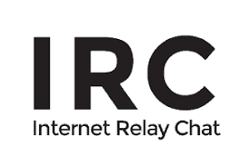

<a name="readme-top"></a>


<!-- PROJECT LOGO -->
<br />
<div align="center">
  <a href="https://github.com/bfjberger/irc_42">
    
  </a>

<h3 align="center">ft_irc</h3>

  <p align="center">
    Summary:
This project is about creating your own IRC server.
You will use an actual IRC client to connect to your server and test it.
Internet is ruled by solid standards protocols that allow connected computers to interact
with each other.
It’s always a good thing to know.
    <br />
    <a href="https://github.com/bfjberger/irc_42"><strong>Explore the docs »</strong></a>
    <br />
  </p>
</div>


<!-- TABLE OF CONTENTS -->
<details>
  <summary>Table of Contents</summary>
  <ol>
    <li>
      <a href="#about-the-project">About The Project</a>
    </li>
    <li>
      <a href="#getting-started">Getting Started</a>
      <ul>
        <li><a href="#prerequisites">Prerequisites</a></li>
        <li><a href="#installation">Installation</a></li>
      </ul>
    </li>
    <li><a href="#usage">Usage</a></li>
    <li><a href="#authors">Authors</a></li>
    <li><a href="#sources">Sources</a></li>
  </ol>
</details>


<!-- ABOUT THE PROJECT -->
## About The Project


<p align="right">(<a href="#readme-top">back to top</a>)</p>

<!-- GETTING STARTED -->
## Getting Started

### Prerequisites


### Installation

1. Clone the repo
   ```sh
   git clone https://github.com/bfjberger/irc_42.git
   ```

<p align="right">(<a href="#readme-top">back to top</a>)</p>


<!-- USAGE EXAMPLES -->
## Usage

1. With our reference IRC client: irssi

* start irssi
  ```sh
  irssi
  ```
* connect to the server
  ```sh
  /connect <ipaddress> <port> <password>
  #hence
  /connect localhost 6667 password
  ```

2. With netcat
	```sh
	nc <host> <port>
	#hence
	nc localhost 6667
	```

Now enjoy

<p align="right">(<a href="#readme-top">back to top</a>)</p>

<!-- Authors -->
## Authors

* [@bberger](https://github.com/bfjberger)
* [@kmorin](https://github.com/Killian-Morin)
* [@pvong](https://github.com/phlearning)

<p align="right">(<a href="#readme-top">back to top</a>)</p>

<!-- SOURCES -->
## Sources

* For the IRC server
  * [RFC 1459 - Internet Relay Chat Protocol](https://datatracker.ietf.org/doc/html/rfc1459)
  * [RFC 2810 - Internet Relay Chat: Architecture](https://datatracker.ietf.org/doc/html/rfc2810)
  * [RFC 2811 -  Internet Relay Chat: Channel Management](https://datatracker.ietf.org/doc/html/rfc2811)
  * [**RFC 2812 - Internet Relay Chat: Client Protocol**](https://datatracker.ietf.org/doc/html/rfc2812)
  * [Numeric Replies](https://www.alien.net.au/irc/irc2numerics.html)

* For irssi
  * https://irssi.org

* For the sockets
  * https://beej.us/guide/bgnet/html/
  * https://www.tutorialspoint.com/unix_sockets/index.htm
  * https://www.ibm.com/docs/en/i/7.2?topic=programming-how-sockets-work

<p align="right">(<a href="#readme-top">back to top</a>)</p>
